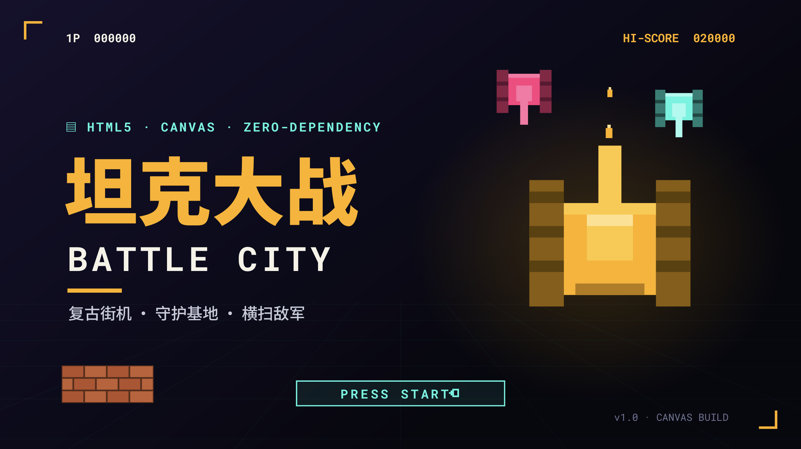

# 坦克大战 · TANK BATTLE

一款基于 HTML5 Canvas 的「坦克大战（Battle City 复刻）」前端游戏。纯原生实现，无构建步骤、无外部依赖、无占位资源，浏览器即开即玩。



---

## 特性

- **经典玩法复刻**：俯视坦克射击、保护基地、多关推进、敌方 AI、道具系统。
- **纯前端实现**：HTML + CSS + 原生 JavaScript（ES2020+），无需打包工具。
- **自合成音频**：Web Audio API 实时生成射击、爆炸、道具、过关音效与循环 BGM，不依赖音频文件。
- **双端操作**：键盘（方向键 / 空格 / J）+ 触屏虚拟摇杆，自动识别移动设备。
- **数据持久化**：`localStorage` 保存最高分、设置与按键映射。
- **可测试架构**：核心逻辑可在 Node 环境下单元测试。

---

## 快速开始

### 直接运行

用浏览器打开项目根目录下的 `index.html` 即可开始游戏：

```bash
open index.html        # macOS
# 或
start index.html       # Windows
```

> 推荐使用本地 HTTP 服务器打开，避免部分浏览器对 `file://` 协议的 localStorage 限制：
>
> ```bash
> python3 -m http.server 8080
> # 然后访问 http://localhost:8080
> ```

### 运行测试

```bash
npm test
# 或
node --test tests/
```

---

## 项目结构

```
├── index.html          # 页面骨架、Canvas、HUD、弹窗、触屏控件
├── css/styles.css      # “战术街机”视觉：深墨背景、CRT 边框、响应式布局
├── js/
│   ├── config.js       # 全局配置：地图、敌人、道具、火力、按键、关卡数据
│   ├── entities.js     # 坦克 / 子弹 / 道具等实体：状态与绘制
│   ├── game.js         # 核心引擎：状态机、主循环、碰撞、计分、道具、渲染
│   ├── input.js        # 输入抽象：键盘 + 触屏 → 统一方向/射击意图
│   ├── audio.js        # 音频管理：音效 + BGM，支持开关/音量/静音降级
│   └── main.js         # UI 编排：实例化、菜单、HUD、事件订阅、配置读写
├── tests/
│   └── tank.test.js    # 核心逻辑单元测试（node --test）
├── docs/               # 系统设计文档
│   ├── README.md       # 文档索引
│   ├── architecture.md # 架构与数据流
│   ├── config.md
│   ├── entities.md
│   ├── game.md
│   ├── input.md
│   ├── audio.md
│   └── ui.md
└── asserts/            # 架构图 / 业务流程图 HTML 可视化
```

---

## 操作说明

| 按键 | 动作 |
| --- | --- |
| `↑` `↓` `←` `→` | 坦克移动，朝向即开火方向 |
| `空格` / `J` | 发射子弹 |
| `P` / `Esc` | 暂停 / 继续 |
| `Enter` | 菜单确认 / 开始 |
| `R` | 结束后重新开始 |

移动端会自动显示屏幕虚拟方向键与射击按钮。

---

## 道具系统

| 道具 | 效果 |
| --- | --- |
| ⭐ 星形 | 升级火力 |
| 🪖 头盔 | 无敌护盾 8 秒 |
| 🔨 铲子 | 强化基地围墙 |
| ⏱ 定时器 | 冻结全部敌军 |
| 💣 手雷 | 清除屏幕所有敌军 |
| 🚗 坦克 | 奖励一条生命 |

---

## 技术栈

- HTML5 Canvas
- 原生 JavaScript（ES2020+）
- Web Audio API
- CSS3
- Node.js Test Runner（测试）

---

## 设计要点

- **依赖单向向下**：`main.js` → `game.js` → `config.js` / `entities.js` / `audio.js` / `input.js`。
- **引擎不直接操作 DOM**：通过 `onEvent` 事件总线向 `main.js` 冒泡状态与 HUD 更新。
- **实体无自碰撞解析**：碰撞逻辑集中在 `game.js`，实体仅通过 `world` 上下文回调查询与驱动。
- **全局命名空间**：所有模块挂载在 `window.TB` 下，便于调试与测试。

更详细的架构说明请查看 [`docs/architecture.md`](./docs/architecture.md)。

---

## License

[MIT](./LICENSE)
