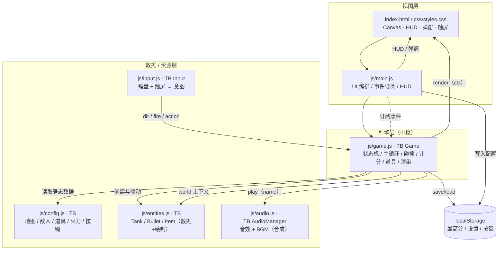
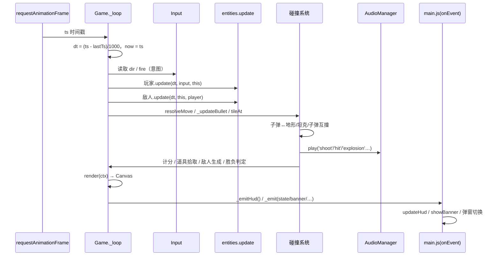
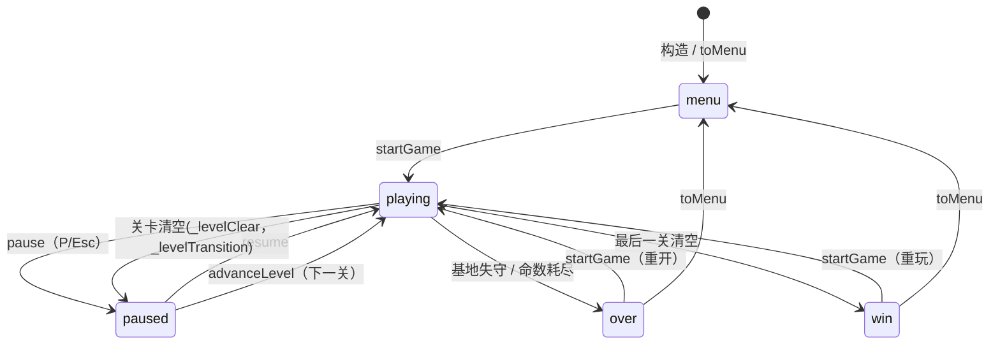

# 系统架构与数据流

本文档描述坦克大战的整体架构、模块间依赖关系，以及一帧（frame）运行时的数据流。

## 1. 分层架构

系统分为三层：**视图层（UI）**、**引擎层（Game）**、**数据/资源层（Config / Entities / Audio / Input）**。引擎层是中枢，负责把输入、配置、实体、音频编排成「更新 → 渲染 → 事件」的闭环。

要点：

- **依赖方向单向向下**：`main.js` 依赖 `game`；`game` 依赖 `config` / `entities` / `audio` / `input`；`config` 不依赖任何模块（纯数据）。
- **实体不包含碰撞解析**：`entities` 只持有自身状态与向量绘制；网格碰撞（`boxHitsSolid` / `resolveMove` / `tileAt`）集中在 `game` 中，通过 `world` 上下文回调驱动实体 `update`。
- **事件总线**：`game` 通过 `onEvent(evt)` 向上层冒泡（`hud` / `banner` / `state` / `levelclear` / `gameover` / `win`），`main.js` 订阅并据此更新 UI。引擎不直接操作 DOM。

## 2. 运行时数据流（单帧）

文字版主循环（`_loop`）：

1. 计算 `dt`（上限 0.05s 防卡顿跳变）与 `now`。
2. **仅在 `playing` 态**执行 `update(dt)`：
   - 铲子计时到期 → 还原基地砖墙。
   - 玩家 `update`：依据 `input.dir` 设朝向并移动（`world.resolveMove`），按 `fire` + 冷却 + 火力上限发射子弹。
   - 敌人生成：剩余数 > 0 且计时到点且同屏未满 → 顶部刷新点生成。
   - 敌人 `update`：AI 选向、移动、定时射击；被冻结则跳过。
   - 子弹 `_updateBullet`：移动 → 命中地形（砖碎/钢挡/基地失守）/ 子弹互撞 / 命中坦克（扣血、击杀计连击分、按概率掉道具）。
   - 道具拾取：玩家矩形与道具矩形重叠 → `_applyItem`（6 类效果）。
   - 粒子推进、对象池清理、屏幕震动衰减。
   - 过关判定：剩余敌人（含待生成）为 0 且玩家存活 → 关卡过场或胜利。
3. `render(ctx)`：背景网格 → 地形 → 道具 → 子弹 → 敌人 → 玩家 → 草遮蔽 → 粒子 → 冻结/震动覆盖。
4. `_emitHud()` 推送 HUD 数据；`requestAnimationFrame` 预约下一帧。

## 3. 状态机

说明：

- `menu / playing / paused / over / win` 五态，引擎 `state` 字段驱动。
- 关卡过场是带 `_levelTransition` 标记的 `paused`（区别于用户暂停），由 `main.js` 在 1.7s 后调用 `advanceLevel()` 进入下一关。
- 持久化在状态切换时静默发生：`saveHighScore()` 于胜利/结束时写入最高分；`saveConfig()` 于设置变更时写入。

## 4. 模块协作速查

| 上游 → 下游 | 传递内容 | 触发点 |
| --- | --- | --- |
| Input → Game | `dir{up,down,left,right}`、`fire`、动作 `pause/confirm/restart` | 每帧 `update`；动作经 `onAction` 边沿触发 |
| Game → Entities | `world` 上下文（`resolveMove`/`spawnBullet`/`tileAt`/`countBullets`/计时字段） | 实体 `update` 内部回调 |
| Game → Audio | `play(name)` 字符串事件 | 射击/命中/爆炸/道具/过关/失败… |
| Game → main | `onEvent({type,...})` | 每帧 HUD、状态变化、横幅、胜负 |
| main → Game | 方法调用：`startGame`/`pause`/`resume`/`advanceLevel`/`toMenu` | 按钮 / 键盘动作 |
| Game ⇄ localStorage | 最高分、配置、按键映射 | 构造加载、胜负保存、设置变更 |
| Game → Config | 读取 `TB.LEVELS` / `TB.ENEMY_TYPES` / `TB.ITEMS` / `TB.POWER_LEVELS` | 关卡构建、实体创建、道具效果 |
